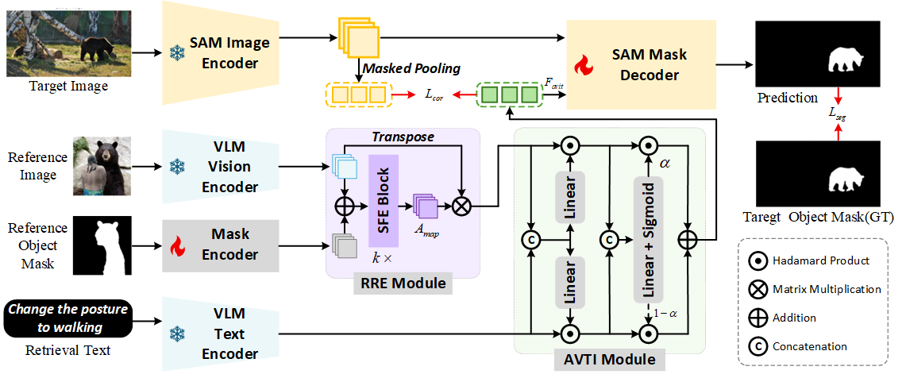

<div align="center">
<h1> Composed Object Retrieval (COR) </h1>
<h3>Composed Object Retrieval: Object-level Retrieval via Composed Expressions</h3>

Tong Wang<sup>1,2</sup>, Guanyu Yang<sup>1</sup>✉️, Nian Liu<sup>2,3</sup>✉️, Zongyan Han<sup>2</sup>, Jinxing Zhou<sup>2</sup>, Salman Khan<sup>2</sup>, Fahad Shahbaz Khan<sup>2</sup>

<sup>1</sup> Southeast University, <sup>2</sup> Mohamed Bin Zayed University of Artificial Intelligence, <sup>3</sup> Northwestern Polytechnical University  
<small>✉️ indicates corresponding authors</small>

[[`Paper`](https://arxiv.org/abs/2508.04424)] 
</div>

## ❗ Update
**We will release the code repository and dataset within one week.**

## 💡 Introduction
Retrieving fine-grained visual content based on user intent is a persistent challenge in multi-modal systems. Existing Composed Image Retrieval (CIR) methods, which combine reference images with textual descriptions, are limited to image-level matching and cannot localize specific objects. To address this, we introduce **Composed Object Retrieval (COR)**, a novel task that advances beyond image-level retrieval to achieve object-level precision. COR enables the retrieval and segmentation of target objects using composed expressions that integrate reference objects with retrieval texts. This task poses significant challenges in retrieval flexibility, requiring systems to accurately identify objects that satisfy the composed expressions while distinguishing them from semantically similar but irrelevant objects within the same scene. 
To support this task, we present **COR127K**, the first large-scale benchmark for COR, comprising 127,166 retrieval triplets across 408 categories with diverse semantic transformations. We also propose **CORE**, a unified end-to-end model that integrates reference region encoding, adaptive visual-textual interaction, and region-level contrastive learning. Extensive experiments demonstrate that CORE significantly outperforms existing models in both base and novel categories, establishing a robust and effective baseline for this challenging task. This work paves the way for future research in fine-grained multi-modal retrieval.


## 🌐 COR127K Dataset
TODO: Provide a detailed description of the COR127K dataset, including its structure, composition, and examples of retrieval triplets.

## 🏫 Baseline Model
TODO: Describe the CORE model architecture, its key components, and its performance metrics on the COR127K dataset.

## 📊 Citation
If this codebase is useful to you, please consider citing:
```
@article{wang2025cor,
      title={Composed Object Retrieval: Object-level Retrieval via Composed Expressions}, 
      author={Tong Wang and Guanyu Yang and Nian Liu and Zongyan Han and Jinxing Zhou and Salman Khan and Fahad Shahbaz Khan},
      journal={arXiv preprint arXiv:2508.04424},
      year={2025},
      url={https://arxiv.org/abs/2508.04424}, 
}
```

## 📝 Acknowledgements
TODO: Acknowledge contributors, funding sources, and any other relevant support for the project.
